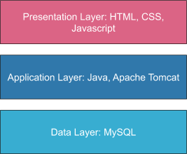
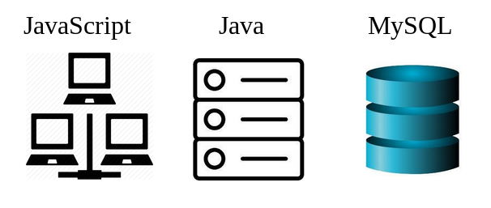
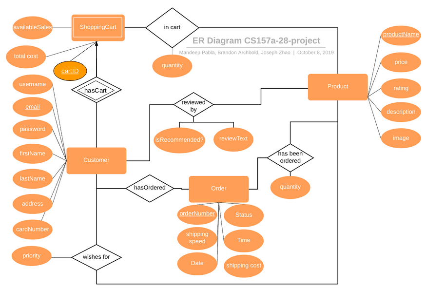
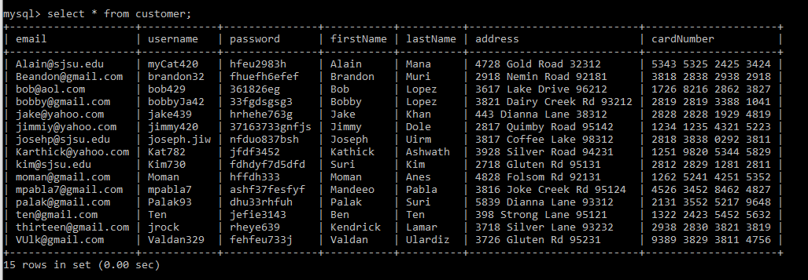
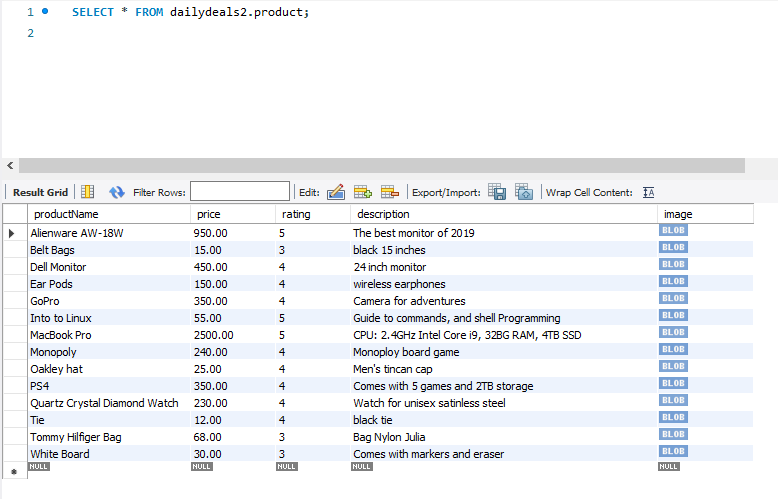
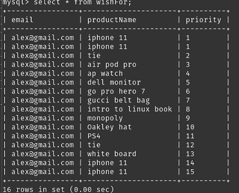
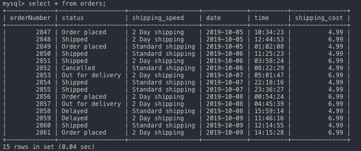
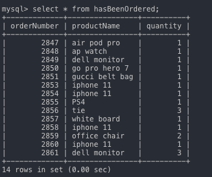
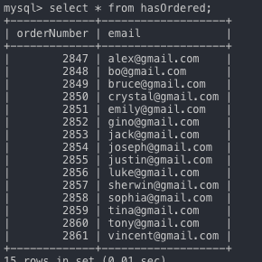

# Three-tier Database Application: Daily Deals Shopping

## Project Requirements Document

#### Team 28 Members: Mandeep Pabla, Brandon Archbold, Joseph Zhao

## Description

We propose a web-based database application that will be a shopping website allowing users to browse and purchase the daily deals on the site. Our application will only allow customers to a limited selection of curated items every day. Features include: user login, sign-up, user authentication, sessions, client-side/server-side validation. The stakeholders for this application are any consumers who shop online, this project is important to them because our project will provide a clean interface to shop for unique curated products with no frills or distractions. The appeal of this website is that is a quick place for shoppers to see the daily deals and quickly purchase items they want or check in the next day to see what is fresh in stock. This will enable us to develop a sleek and fast product for the customers.

## Functional Requirements

Users will be able to access our application through their web browser. The application will allow users to sign-up and will store the username & password hash in a table inside the database. If the user wants to log in, then we can query the corresponding login information and authenticate the user. Users will be able to select products they would like to purchase and continue through the checkout process. The following features will be supported on our website:

- Account Registration
  - This feature will allow any person to create an account with a valid email. Registration will require first name, last name, email, and password. These items will all be stored in the database and used for user authentication. The password will be saved as a hash in the database.
  - Emails will be validated to ensure they are formatted correctly.
  - Passwords will have a minimum requirement of 8 characters, and at least one number and one symbol
- Log in system
  - Customers will be able to securely log into the website by entering their email and password, the login information will be securely sent using SSL when the final project is launched.
    -The hashed password will be queried from database by email. Then the hash will be compared with the hashed password from user’s input. The plain text is never used after account registration.
- Browse products
  - Customers will be able to browse items from our main page. They will be able to view detailed descriptions when they click on the items. They will be taken to another page for the product details.
  - Everyday there will be 10-20 items to browse. This enables shoppers to quickly visit our site and see what deals there are today and then quickly purchase the desired items if wanted.
- Product detail page outlining the product description
  - Reviews
    - Each product will feature a section allowing registered customers to leave a review with a thumbs up or thumbs down to go along with their review. The site will then calculate which percentage of users recommend the product.
    - The percentage of people who liked the product will be displayed under the product name
  - other information regarding the product
    - Product dimensions
    - Product specification
    - additional images
  - Price
    - Customers will be able to view product prices.
- Shopping cart
  - In the shopping cart, there will be items’ name and quantity as well as a total price.
  - The shopping car will also show any available sales and promotions a customer has
- Checkout and confirmation page

  - At the checkout page, customers can make adjustments to quantities of the items, fill out payment & delivery information, and submit order. Customers will receive an order#.
  - Customers will be able to choose from saved delivery and payment information.
  - Customers will have the option to save their delivery information for future use.
  - Customers will have the option to save their payment information for future use.
  - If Customers choose to save their payment/shipment information, the information will be saved under customer’s profile, otherwise the information will only be used once for the order.

- Order history page
  - From the order history page, customers can view their previous orders, including items’ name, quantity, and total price.
- Account management page
  - A simple account management page will provide quick access to common features such as:
  - changing password
  - changing address
  - changing email address
  - and other account-related settings.
- Wishlist feature
  - Customers will be able to wishlist items they would like to buy in the future. This will enable them to purchase the item at a later time. The list of items on a customer's wish list will also be stored in the database. Wishlisted items can only be purchased when the item is in stock.
- Orders to be filled (Business view)
  - The software will support a view of all the orders that have been placed and need to be filled.
  - Each order page will display what the customer purchased, the quantity of items, as well as the customer’s shipping address

### Description of a Typical User

A typical user of our website is someone who enjoys online shopping but does not have the time to browse through the endless amount of products available on other websites to have to hunt for a deal. Our website will provide customers seeking daily deals a quick place to stop by and buy some sweet items. Our typical user base is any and all online shoppers interested in a simpler way to shop.

### Standard User Flow

A standard flow a user would go through when visiting our site would be the following:

1. Navigate to our website using their browser
2. View and browse through today's available products
3. click on a product to visit the details page
4. view user reviews, item specifications
5. scroll through images of the product
6. click on the add to cart button
7. click on the shopping cart to proceed to checkout
8. use email and password to login or sign up as a new user
9. Once on the checkout page, the user can select the quantity of items
10. Enter payment information
11. Enter shipping and billing info
12. View a confirmation page
13. Confirm order

## System Enviornment

JSP will be used for webpage scripting and Apache Tomcat will deploy Java Servlets and JSP. The backend of the application will be developed using Java which is utilized in the Application Layer. The Application Layer will communicate with the Data Layer using JDBC. For the middleware “business” tier we will use Apache Tomcat/Jetty to deploy our webserver. Lastly, we will use MySQL/PostgreSQL for the database itself in the data layer.

## More details

- Application Languages: Java 8, JavaEE 7, HTML5, CSS3, JSP, JavaScript 1.8.5, XML, MySQL
- Software Used: Apache Tomcat, Gradle
- RDBMS: MySQL Community Server 5.7.19

## Non-functional issues

### GUI

We will use HTML, CSS, and Javascript to build the front end of our website to be displayed in the browser. JSP will be used for webpage scripting and Apache Tomcat will deploy Java Servlets and JSP.

Products will be displayed in a 4 x 5 grid where 10-20 products will be displayed at any given time. The top of the website will feature our logo, and navigation links on the top right hand side. There will be an account page to manage your account and a logout button. If a user does not have an account, they will be directed to do so when attempting to purchase a product or when clicking on the account link.

Each product in the grid will display an image of the product, the name of the product, the price, and show the percentage of users that recommend the product.

On the product details page you will see the name of the product at the top, below it the percentage of people that liked the product, with a thumbs up for ratings of over 70% and thumbs down for ratings below 40%. Ratings between 40% and 70% will be represented as an orange circle. On the left there will be a product preview pane where the user may browse through several images of the product (if available). On the right of the image will be the price, and below it the product specifications and details. On the right side of this section there will be a button that lets users add the product to the shopping cart.

Below this section will be a product details page with further details about the product (if available). Below this section will be a reviews section with reviews of the product.

### Security

For user authentication we will use SSL (when the website goes live) and only store the hash of the user’s password so that if the database gets hacked, the user’s passwords are safe from attackers. This will be the only access control as we would like anyone to be able to buy products from our website as long as they create an account. Users will be authenticated with their username and password combination. Users will only be able to access the account information of their own account and will not be able to view other members orders or personal information. All product information will be public to all users.

## Project Data Model and DB Design

**Customer:** This entity set keeps track of all the customers and the information that is relevant to each. The email is the customer’s primary key as it is required to create an account and it must be unique so it is an obvious choice. Customer has many relationships as they customer can review products, place items in their cart, order products, and place items in their wishlist. The relation schema for Customer is the following: Customer(username, email, password, firstName, lastName, address, cardNumber).

**Order:** This entity set keeps track of all orders with a primary key of a unique orderNumber. This set is used by customers to see what they have ordered, and by the business to see what has been ordered and what needs to be shipped. The relation schema for Order is the following: Order(orderNumber, Status, shipping_speed, Time, Date, shipping_cost).

**Product:** This entity set contains all the available products with the productName as the primaryKey as no two products can share the same name.Products can be placed in shopping carts, ordered, reviewed, or placed in a customer’s wish list. The relation schema for Product is the following: Product(productName, price, rating, description, image).

**hasCart:** This relationship occurs when a customer places a product in their shopping cart for checkout. The cart will total the cost of products in the cart.The schema for this relation is hasCart(email, cartID)

**in cart:** This relationship links the products and quantity of products in a given shopping cart. The schema for this relation is inCart(cartID, productName, quantity)

**reviewed by:** This relationship is used for customer reviews of products. If an entry exists that means that a particular customer has left a review for that particular product. The schema for this relation is reviewedBy(email, productName, isRecommended, reviewText)

**hasOrdered:** This relationship indicated which customer has made a particular order. This links the customer to the order. The schema for this relation is hasOrdered(email, orderNumber)

**hasBeenOrdered:** This relationship indicates which products are in a particular order and the quantity of those products. The schema for this relation is (orderNumber, productName, quantity)

**wishes for:** This relationship indicates which products a customer has on their wishlist. The customer can view a list of their items organized by the priority in which they would like. The schema for this relation is wishesFor(email, productName,priority)

**ShoppingCart:** The entityset contains all available sales and the total cost of products. The relation schema for ShoppingCart is the following: ShoppingCart(cartID, availableSales, total_cost)

## Tables 

CREATE TABLE `dailydeals`.`customer` (
  `email` VARCHAR(150) NOT NULL,
  `username` VARCHAR(45) NOT NULL,
  `password` VARCHAR(45) NOT NULL,
  `firstName` VARCHAR(45) NOT NULL,
  `lastName` VARCHAR(90) NOT NULL,
  `address` VARCHAR(90) NOT NULL,
  `cardNumber` VARCHAR(120) NOT NULL,
  PRIMARY KEY (`email`));

CREATE TABLE `dailydeals`.`product` (
  `productName` VARCHAR(150) NOT NULL,
  `price` DECIMAL(6,2) NOT NULL,
  `rating` TINYINT(1) NOT NULL,
  `description` VARCHAR(250) NOT NULL,
  `image` LONGBLOB NOT NULL,
  PRIMARY KEY (`productName`));

CREATE TABLE `dailydeals`.`order` (
  `orderNumber` INT NOT NULL,
  `status` VARCHAR(45) NOT NULL,
  `shipping_speed` VARCHAR(45) NOT NULL,
  `date` DATE NOT NULL,
  `time` TIME NOT NULL,
  `shipping_cost` DECIMAL(6,2) NOT NULL,
  PRIMARY KEY (`orderNumber`));

CREATE TABLE `dailydeals`.`wishFor` (
  `email` VARCHAR(150) NOT NULL,
  `productName` VARCHAR(150) NOT NULL,
  `priority` VARCHAR(30) NOT NULL,
  FOREIGN KEY (`email`) REFERENCES `customer`(`email`), 
  FOREIGN KEY (`productName`) REFERENCES `product`(`productName`)
);

CREATE TABLE `dailydeals`.`review`(
  `email` VARCHAR(150) NOT NULL,
  `productName` VARCHAR(150) NOT NULL,
  `isRecommended` BOOLEAN NOT NULL,
  `reviewText` VARCHAR(1000),
  FOREIGN KEY (`email`) REFERENCES `customer`(`email`),
  FOREIGN KEY (`productName`) REFERENCES `product`(`productName`)
);

CREATE TABLE `dailydeals`.`hasBeenOrdered`(
  `orderNumber` INT NOT NULL,
  `productName` VARCHAR(150) NOT NULL,
  `quantity` SMALLINT NOT NULL,
  FOREIGN KEY (`orderNumber`) REFERENCES `order`(`orderNumber`),
  FOREIGN KEY (`productName`) REFERENCES `product`(`productName`)
);

create table `inCart`(`email` varchar(150) NOT NULL, 
`productName` VARCHAR(150) NOT NULL, 
`quantity` INT(2) NOT NULL,
FOREIGN KEY(`email`) REFERENCES `customer`(`email`), 
FOREIGN KEY(`productName`) REFERENCES `product`(`productName`));

create table `reviewedBy`(`email` varchar(150) NOT NULL,
  `productName` VARCHAR(150) NOT NULL,
  `isRecommended` TINYINT(1) NOT NULL,
  `reviewText` VARCHAR(1000),
  FOREIGN KEY(`email`) REFERENCES `customer`(`email`),
  FOREIGN KEY(`productName`) REFERENCES `product`(`productName`));

create table `shoppingCart`(`email` varchar(150) NOT NULL,
`avalibleSales` INT, 
`totalCost` DECIMAL(6, 2) NOT NULL,
FOREIGN KEY(`email`) REFERENCES `customer`(`email`));

CREATE TABLE `dailydeals`.`websiteReview`(
  `email` VARCHAR(150) NOT NULL,
  `reviewText` VARCHAR(1000),
  FOREIGN KEY (`email`) REFERENCES `customer`(`email`)
);

## Tables with data

## Implementation

Our database application was implemented using Java Server Pages for the front end Java Servlets and Java Objects to function as our middleware and finally MySQL connected using JDBC for our database.

## Running & Installation

To run our code there are a few considerations that are needed.

1. Before anything else you should set up a mysql database, I’ll assume you know how to do that
    1. In MySQL create a new schema called dailyDeals
    1. Import our database file with default information into the dailyDeals schema: [Link to File](https://drive.google.com/open?id=1y-sD3MT82hMu9CZrhh9USQuo6LQSTmJP)
1. First you must clone our project onto your machine, then import the dailydeals folder from our repo into Eclipse EE. 
1. Once imported you must install the JSTL and Connector J libraries (JDBC).
    1. Download version 1.2.7 of JSTL here https://github.com/eclipse-ee4j/jstl-api/releases
    1. Download the jar file of Connector J from here https://dev.mysql.com/downloads/connector/j/
    1. In Eclipse open the dailydeals project and then right click on it in Project Explorer
    1. Then click on properties.
    1. Click Java Build Path
    1. Select the Libraries Tab
    1. Click Add External JARs
    1. Select and add both the JSTL and Connector J jars
    1. Click Apply
    1. Click Deployment Assembly on the left hand side
    1. Click Add…
    1. Select Java Build Path Entries
    1. Select the Jar files you just added, you may have to do this one at a time
    1. click finish
    1. Finally click Apply and Close
1. You must also have Tomcat 8.5 or above downloaded in a directory
    1. You can download Tomcat 9 here https://tomcat.apache.org/download-90.cgi
1. You must also enter your MySQL username and password in all of the files contained in the following folder:
    1. dailydeals/src/main/java/DAOs
    1. Open each file and simply press ctrl + f and search for password to jump to the correct location in each file, insert your mysql password in between the quotes for password, and your username in the DAO objects as well
1. Now navigate through the project in eclipse to dailydeals/src/main/webapp
1. Right click on the loginPage or SignUp page
1. Choose run as run on server
    1. The first time it will ask you to configure the server
    1. Select the tomcat version you selected and then select the location you downloaded tomcat to
    1. Then click finish
1. The server should start and our application should run
1. if not right click on the jsp file again and then click run as run on server and that’s it!

## Project Conclusion

Brandon Archbold: I learned a lot about web development including how the front end talks to the backend particularly with JSP files, Java Servlets and accessing the database using database access objects in Java using JDBC. I also learned more about how to use a database, how database design can impact the project. I learned how to run and test a project using JSP, tomcat, and eclipse. I also learned how to pass information between all of the different files and tools we used. I also learned that we were a bit too ambitious with our functional requirements since we did not know any of the technologies we needed to use to build this project besides java.

## Future Improvements

Future improvements to our project would include allowing users to view their order history in an easier to access location. We would also include a backend portal to sellers in the future as well as a way to add and remove products in the GUI. We could also host our application on AWS or a similar cloud platform.